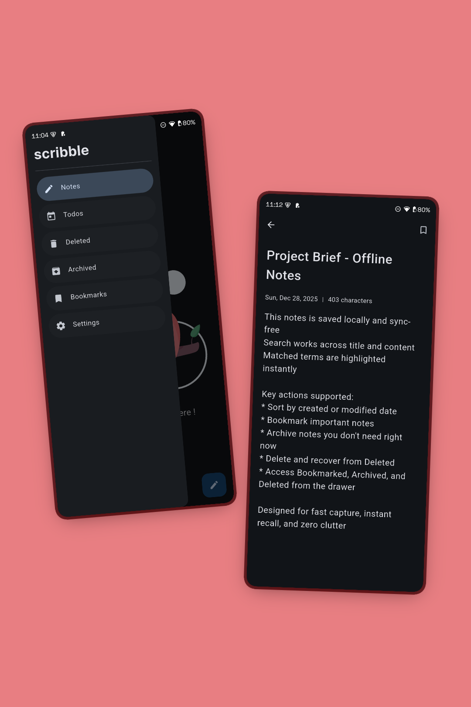
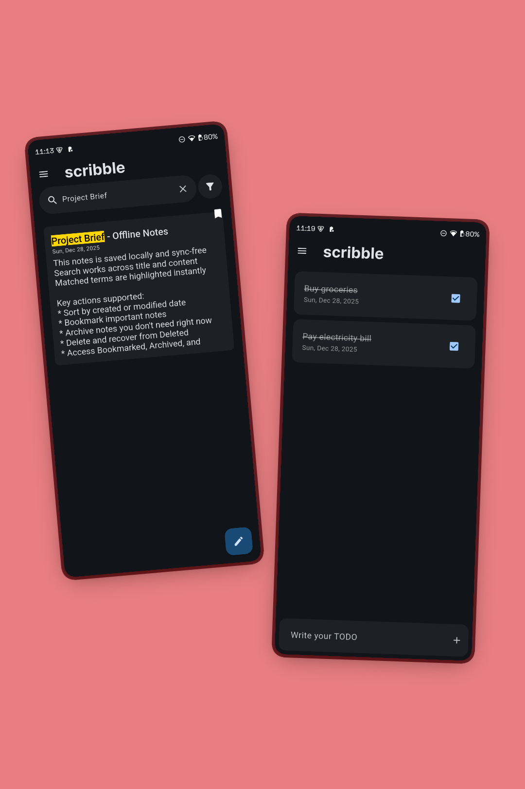
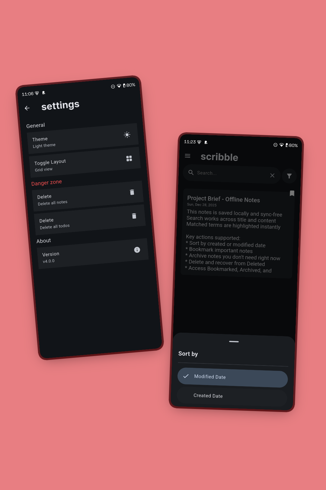

# Scribble

Simple minimalist note taking app buit using flutter.

## Get it on Playstore
https://play.google.com/store/apps/details?id=com.widgetsandco.scribble

  
  
  

## Features

1. Creation of notes
2. Updation of notes
3. Deletion of Notes
4. Reading the Notes
5. Dynamic Colours
6. Supports grid view and List view

## Tech Stacks

1. Sqlite Database for local storage and persistence of data
2. Flutter BLoc for state management 

## How to use it

1. To create a note just click the button on the bottom right corner in your home page
2. To update a note just click on a note
3. To delete a note, long press on any note to bring the menu
4. To modify the note as read only click on the lock icon

## Installation

1. Clone the repo and Build the apk or app bundles using <flutter build apk> or <flutter build appbundlke>
2. Or just download the app by going to the resource section in the same page here

## What can you do?

Feel free to use the code as you wish, fork the repo and build your own flavor or help us improve the project, totally up to you

## Licences 

Icons by flat icons 
Fonts by Google fonts
